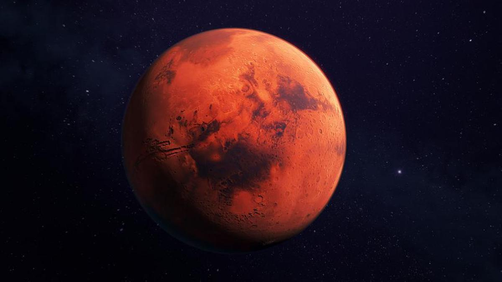

# Mars

Mars est la quatrième planète du Système solaire par ordre croissant de la distance au Soleil et la deuxième par ordre croissant de la taille et de la masse.

## Caractéristiques

- Masse : 6.418 x 1023 kg
- Rayon moyen volumétrique : 3 389.5 km
- Distance au soleil :
  - Aphélie : 2.49 x 108 km
  - Périhélie : 2.07 x 108 km
  - Demi-grand axe : 2.28 x 108 km
