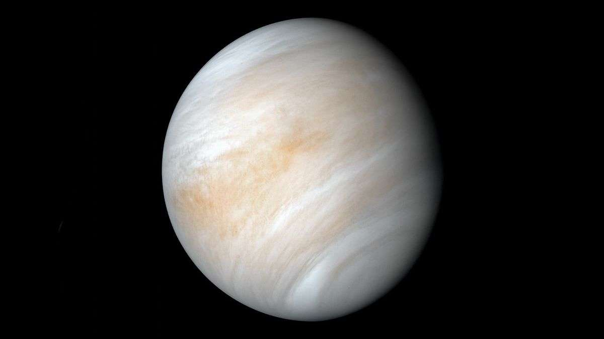

Venus

## Caractéristiques

- Masse : 4,867 x 1024 kg
- Diamètre : 12 103,6 km
- Distance au soleil :
  - Aphélie : 108 943 000 km
  - Périhélie : 107 476 000 km
  - Demi-grand axe : 108 209 500 km
- Symbole : &#x2640;
